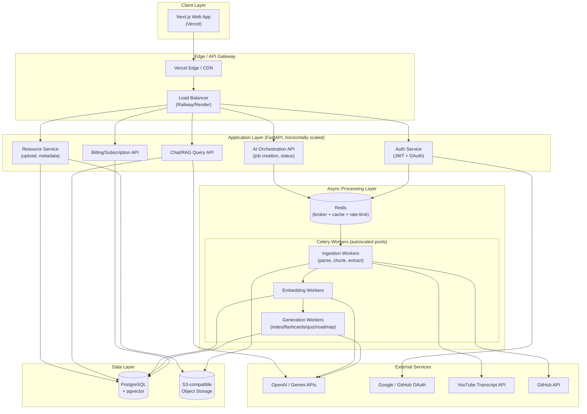
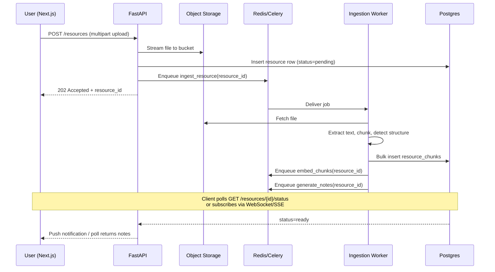
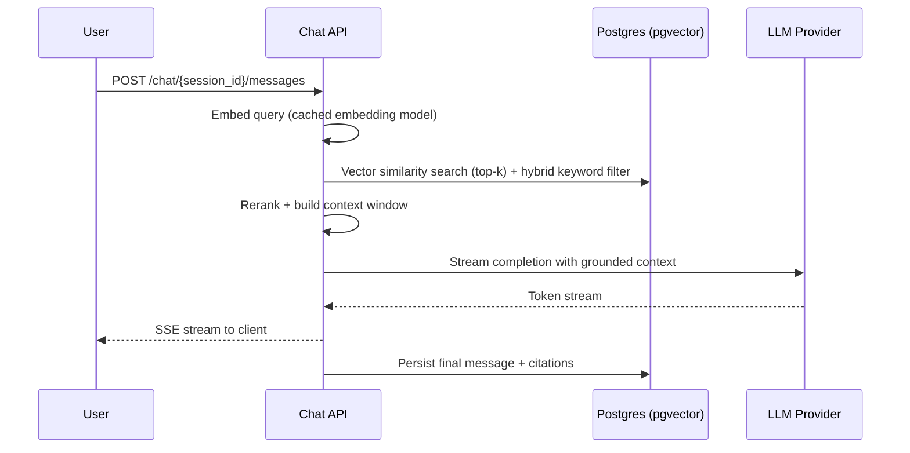

# Lumora — System Architecture Overview

**Document owner:** Architecture Team
**Status:** Living document (v1.0)
**Audience:** Engineering, DevOps, new hires

---

## 1. Product Framing

Lumora is not a note-taking app. It is an **AI learning companion** that ingests heterogeneous
learning material (PDFs, YouTube videos, GitHub repos, websites, PPTs, markdown, raw notes) and
turns it into a structured, queryable, personalized knowledge base — notes, flashcards, quizzes,
roadmaps, revision plans, and a chat interface grounded in the user's own material.

This framing has direct architectural consequences:

- **Ingestion is a first-class, hard problem.** Every source type has a different extraction
  and chunking strategy. This is not "upload a file to S3" — it's a multi-stage content
  pipeline.
- **Everything downstream is AI-generated and asynchronous.** Notes, flashcards, quizzes,
  roadmaps are *derived artifacts*, not user-authored content. They must be regenerated,
  versioned, and cached intelligently.
- **Retrieval quality is the product.** RAG correctness directly determines whether "Chat with
  your resources" feels magical or useless. This pushes real engineering weight onto the
  vector/embedding layer, not just the LLM prompt.
- **Cost is a first-order constraint.** At 100k+ users, naive "call GPT-4 on every request"
  design bankrupts the business. Caching, model tiering, and batching are architectural
  requirements, not optimizations.

---

## 2. Design Philosophy

| Principle | What it means for Lumora |
|---|---|
| **Modular monolith first, not microservices-day-one** | A single FastAPI service with clean internal module boundaries (auth, resources, ai, billing) is faster to build, debug, and deploy at current scale. Service extraction happens only when a subsystem has genuinely different scaling/deploy characteristics (see §7). |
| **Async-first for anything AI-related** | No AI generation call ever blocks an HTTP request/response cycle. Every AI job is enqueued to Celery and the client polls or subscribes for status. |
| **Idempotent, resumable pipelines** | Ingestion and generation jobs must survive worker crashes, network blips, and rate-limit backoffs without corrupting state or double-charging AI credits. |
| **Everything derived is versioned & cache-aware** | Notes/flashcards/quizzes are content-addressed by `(resource_id, content_hash, prompt_version, model_version)` so regeneration is explicit, not accidental. |
| **Multi-tenant from day one, single-tenant complexity avoided** | Every table carries `user_id`/`workspace_id`; row-level isolation is enforced at the ORM layer, not bolted on later. |
| **Design for 100k users, not 100M** | We intentionally avoid premature infra (Kafka, multi-region, service mesh) that adds operational tax without current need. The doc calls out exactly where those upgrades happen later. |

---

## 3. High-Level Architecture

**Reading the diagram:** the API layer never talks to the LLM synchronously except for the
low-latency **Chat/RAG query path** (which uses cached embeddings + streaming responses, so it's
fast enough to stay in the request/response cycle). Everything that involves *generating new
long-form content* (notes, flashcards, quizzes, roadmaps, full-repo analysis) goes through Celery.

---

## 4. Core Subsystems

| Subsystem | Responsibility | Key data owned |
|---|---|---|
| **Auth & Identity** | JWT issuance/refresh, Google/GitHub OAuth, session/device management | `users`, `oauth_accounts`, `refresh_tokens` |
| **Resource Ingestion** | Upload handling, format detection, source-specific extraction (PDF/YT/repo/site/PPT/MD), chunking | `resources`, `resource_chunks`, `ingestion_jobs` |
| **Embedding & Vector Store** | Generates and stores embeddings per chunk, manages pgvector indexes | `chunk_embeddings` |
| **AI Generation Engine** | Notes, summaries, flashcards, quizzes, concept explanations, repo analysis, roadmaps, revision plans | `notes`, `flashcards`, `quizzes`, `roadmaps`, `revision_plans` |
| **RAG Chat Engine** | Retrieval + reranking + grounded chat over a user's resources | `chat_sessions`, `chat_messages` |
| **Progress & Analytics** | Spaced-repetition scheduling, quiz performance, roadmap completion tracking | `study_events`, `progress_snapshots` |
| **Billing & Plans** | Subscription tiers, usage metering (AI credits), quota enforcement | `subscriptions`, `usage_ledger` |
| **Notifications** | Email/in-app nudges for revision reminders, job completion | `notifications` |

---

## 5. Request Lifecycle Examples

### 5.1 "Upload a PDF and generate notes" (async path)

### 5.2 "Chat with your resources" (sync, low-latency path)

---

## 6. Why Modular Monolith, Not Microservices (Tradeoff Discussion)

**Chosen: single FastAPI deployment with strict module boundaries**, Celery workers as separately
deployed processes (not separate "services" in the API sense).

| Factor | Modular Monolith (chosen) | Full Microservices |
|---|---|---|
| Team size fit | Matches a small-to-mid engineering team | Needs per-service ownership to justify overhead |
| Deployment complexity | One image, one CI pipeline (+ worker image) | N pipelines, N on-call rotations |
| Latency | In-process calls where needed, no internal network hops | Extra hops for cross-service reads (e.g., billing checking resource count) |
| Independent scaling | Achieved via **separate worker pools**, not separate services | Achieved via separate services (more granular but costlier) |
| Failure isolation | Weaker (bug in one module can affect process) | Stronger, but only matters once modules have truly divergent reliability needs |
| Right-sized for | 0 → ~200k users | Post product-market-fit hyperscale |

The Celery workers already give us **process-level isolation and independent scaling** for the
most resource-hungry part of the system (AI generation) without paying the full microservices
tax. This is deliberately the same shape Notion and Linear used in their early years.

**Revisit trigger:** if the Resource Ingestion or Billing subsystems need independent deploy
cadences, different language runtimes, or separate compliance boundaries, extract them first —
see `05-scalability-deployment.md` §6.

---

## 7. Non-Functional Targets (100k user scale)

| Metric | Target |
|---|---|
| Concurrent active users | ~5–8k peak (assuming ~5-8% concurrency of 100k MAU) |
| API p95 latency (non-AI endpoints) | < 200ms |
| Chat RAG first-token latency | < 1.5s |
| Ingestion → notes-ready (avg PDF, 20 pages) | < 45s |
| Ingestion → notes-ready (1hr YouTube video) | < 90s |
| Uptime SLA | 99.9% (≈ 8.7h downtime/year) |
| Data durability | 99.999999999% (S3-class) via provider guarantees |

These numbers drive queue design, worker autoscaling policy, and caching strategy detailed in
the later documents.

---

## 8. Document Map

1. `01-system-architecture-overview.md` — this document
2. `02-database-design.md` — schema, ERD, pgvector indexing strategy
3. `03-ai-rag-pipeline.md` — ingestion, embeddings, RAG, generation workers
4. `04-api-and-auth-design.md` — API contracts, JWT/OAuth, RBAC, rate limiting
5. `05-scalability-deployment.md` — infra topology, caching, observability, future scaling
