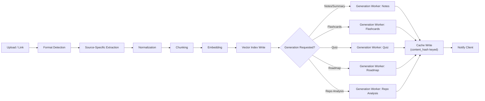
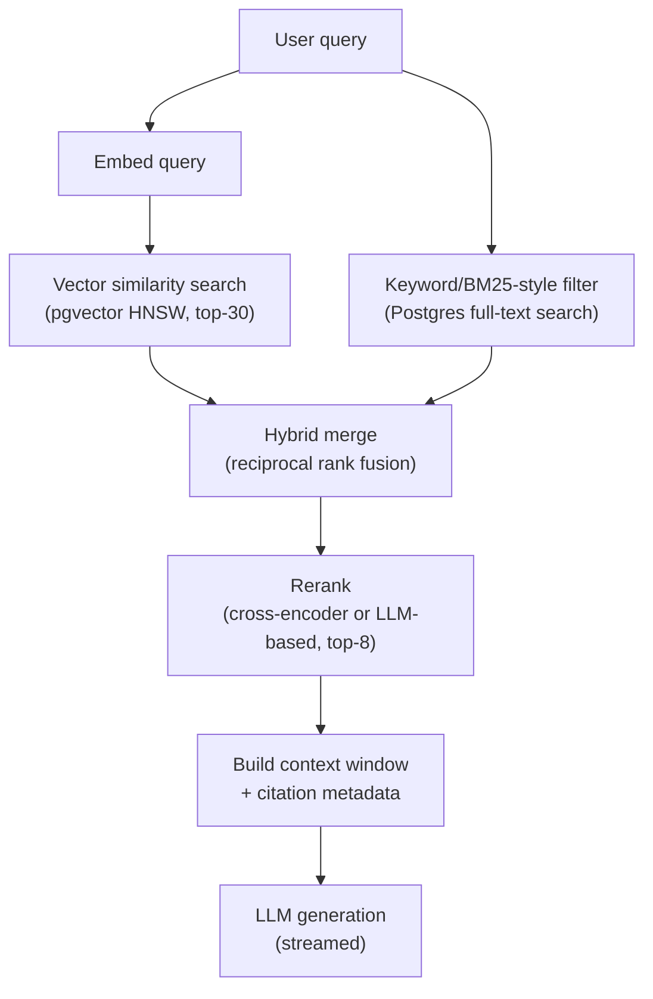
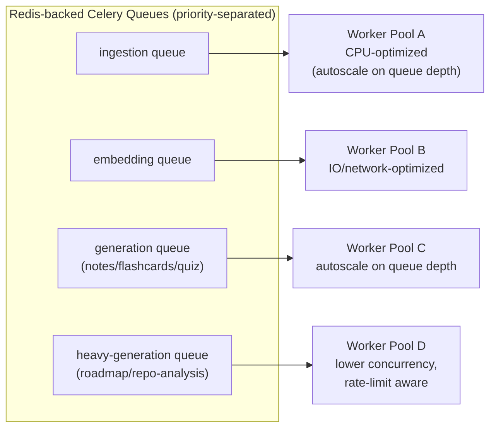

# Lumora — AI & RAG Pipeline Architecture

This document covers ingestion, chunking, embeddings, retrieval, and generation — the parts of
the system that turn raw uploaded material into structured, queryable learning content.

---

## 1. Pipeline Stages, End to End

Every stage is a **separate Celery task**, chained via task callbacks, not one monolithic
function. This matters because:
- Each stage has different failure modes and retry semantics (extraction can fail on a corrupt
  PDF; embedding can fail on provider rate limits; generation can fail on content-policy
  rejections) — isolating them means a failure in one stage doesn't require redoing prior stages.
- Each stage has different resource profiles (extraction is CPU/IO-bound, embedding is
  network-bound, generation is network + token-cost-bound) — isolating them lets us autoscale
  worker pools independently (see §5).

---

## 2. Source-Specific Extraction & Chunking

| Source type | Extraction approach | Chunking strategy |
|---|---|---|
| **PDF** | Text-layer extraction (PyMuPDF/pdfplumber); OCR fallback (Tesseract) for scanned pages | Semantic chunking by section/heading detection, capped at ~500–800 tokens with 10–15% overlap; page number retained per chunk for citation |
| **YouTube video** | Transcript API (or Whisper fallback if no captions) | Chunked by timestamp windows (~60–90s of speech) aligned to sentence boundaries; timestamp range retained for "jump to this part of the video" citations |
| **GitHub repository** | Clone shallow, walk file tree, respect `.gitignore`, skip binaries/lockfiles | Chunked **per function/class** using language-aware AST parsing where possible (tree-sitter), falling back to fixed-size chunks for unsupported languages; file path + line range retained |
| **Website** | Fetch + readability extraction (strip nav/ads/boilerplate) | Chunked by DOM heading structure (h1/h2/h3 sections) |
| **PPT** | Slide-by-slide text + speaker notes extraction | One chunk per slide (or merged with adjacent slides if very short), slide number retained |
| **Markdown / raw notes** | Direct parse | Chunked by heading hierarchy, preserving heading path as metadata (e.g., `"Chapter 3 > Photosynthesis > Light Reactions"`) |

**Why per-type chunking instead of one universal chunker:** a fixed-size token chunker applied
uniformly is the single biggest cause of poor RAG recall in practice — it slices code functions
in half, separates a video's spoken sentence across two chunks, or splits a slide's bullet list
from its header. Respecting each format's native structure costs more engineering effort upfront
but is the single highest-leverage investment for retrieval quality, which is the core product
promise ("chat with your resources" only works if retrieval actually finds the right passage).

---

## 3. Embedding Strategy

- **Model:** configurable per deployment — OpenAI `text-embedding-3-small` as default (good
  cost/quality tradeoff), with a Gemini embedding model as a swappable alternative behind an
  interface (`EmbeddingProvider` abstraction), so a provider outage or pricing change doesn't
  require a data migration to switch.
- **Dimension:** stored explicitly per row (`chunk_embeddings.dims`) so multiple embedding models
  can coexist during a migration window (re-embedding is itself a background job).
- **Batching:** embedding requests are batched (e.g., 100 chunks/request) rather than one call per
  chunk — this is a straightforward 10–50x reduction in API round-trip overhead and cost at scale.
- **Deduplication:** chunks are hashed (`content_hash`) before embedding; if an identical chunk
  already has an embedding (common with re-synced GitHub repos or re-uploaded PDFs), the existing
  embedding is reused rather than re-computed.

### Tradeoff: single embedding model vs. multi-model
| | Single model (current default) | Multi-model support (built-in, unused by default) |
|---|---|---|
| Simplicity | Simple, one vector column | Requires model_version tracking, more complex queries |
| Migration cost when switching models | Full re-embed of all chunks | Can run old + new side by side during transition |
| Chosen | **Yes, but schema supports the migration path** | Available when needed |

---

## 4. Retrieval (RAG) Architecture

**Why hybrid search, not vector-only:** pure embedding similarity misses exact-match cases that
matter a lot in study contexts — a student searching for a specific term, formula name, or code
symbol wants exact/keyword matches surfaced even if their semantic embedding neighbors aren't the
literal top hits. Combining vector search with Postgres full-text search (via reciprocal rank
fusion) is a well-established pattern (used by GitHub's own code search, among others) that
meaningfully improves recall for this kind of query mix, at negligible extra latency since both
searches run against the same database.

**Why a reranking step:** the initial top-30 retrieval is intentionally over-fetched and then
narrowed to the actual context window (~6–8 chunks) using a reranker. This two-stage
retrieve-then-rerank pattern consistently outperforms retrieving fewer chunks up front, because
embedding similarity alone is a noisy approximation of "is this actually the most relevant
passage for this specific question."

**Citations:** every chunk carried into the context window keeps its `structural_metadata`
(page/timestamp/file-line/slide/heading), so the chat response can cite "page 12" or "3:42 in the
video" or "auth.py lines 40–58" rather than a vague reference.

---

## 5. Generation Workers

Each derived-content type is a distinct Celery task with its own prompt template, output schema,
and validation step:

| Worker | Input | Output validation |
|---|---|---|
| Notes/Summary | Full chunk set for a resource | Structured JSON (headings, bullet points, key terms) validated against a Pydantic schema before persisting |
| Flashcards | Notes (not raw chunks — generating from already-distilled notes improves quality and reduces token cost) | Q/A pairs, deduplicated against existing flashcards for the same resource |
| Quiz | Notes + flashcards | MCQ/short-answer schema, difficulty-tagged |
| Concept Explanation | On-demand, single concept + relevant chunks (RAG-scoped, not full resource) | Free text, but grounded — citations required |
| Repository Analysis | Repo chunks, weighted toward README + entry points + high-fan-in files | Structured: architecture summary, key modules, suggested learning order |
| Roadmap | User's full resource library + stated learning goal | Ordered DAG of topics/resources with prerequisite edges |
| Revision Plan | Flashcard performance history (`revision_items`) | Spaced-repetition schedule (SM-2-style algorithm) |

**Idempotency & retries:** every generation task first checks the cache key
(`resource_id + content_hash + prompt_version + model_version`) before calling the LLM. On
failure, Celery's retry-with-backoff handles transient provider errors; a dead-letter queue
captures tasks that exhaust retries for manual/automated follow-up, rather than silently dropping
them.

**Structured outputs:** generation prompts request strict JSON output (schema-constrained via the
provider's structured-output/function-calling mode where available), parsed and validated before
being written to Postgres — this avoids the class of bugs where an LLM's free-text response
breaks downstream rendering.

---

## 6. Cost Control Strategy

At 100k users, naive LLM usage is the single biggest threat to unit economics. Controls:

1. **Cache-first generation** — never regenerate unchanged content (content-hash keyed, §5 above).
2. **Model tiering** — cheaper/faster models (e.g., GPT-4o-mini / Gemini Flash tier) for
   high-volume, lower-stakes tasks (flashcard generation, chunk summarization); stronger models
   reserved for chat and complex reasoning (roadmap generation, repo analysis).
3. **Distillation chaining** — generate flashcards/quizzes from already-generated notes, not raw
   chunks, cutting input token volume significantly for those tasks.
4. **Batched embedding calls** (§3).
5. **Quota enforcement via `usage_ledger`** — plan-tier limits checked before a job is enqueued,
   not after the LLM call completes, avoiding wasted spend on jobs that will be rejected anyway.
6. **Context window discipline** — RAG retrieval intentionally narrows to 6–8 chunks (§4) rather
   than stuffing maximal context, which is both a quality and cost lever.

---

## 7. Background Worker Topology

Separate queues per stage (rather than one generic queue) let us:
- Prioritize interactive-adjacent work (a user waiting on their first notes) over batch work
  (a nightly re-embedding job).
- Apply different concurrency limits per pool — heavy generation tasks are deliberately
  throttled to respect LLM provider rate limits and avoid one tenant's large job starving others.
- Scale worker pools independently based on queue depth (via Celery's queue-length metrics feeding
  autoscaling rules on Railway/Render).
