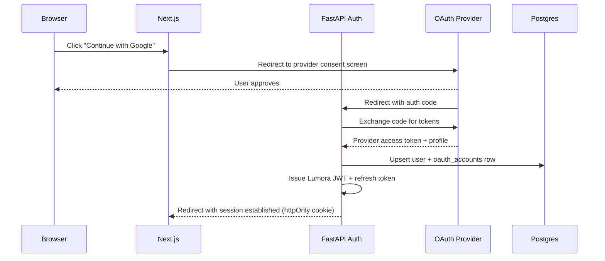

# Lumora — API & Authentication Design

---

## 1. API Design Principles

- **REST over the FastAPI router**, versioned from day one: `/api/v1/...`. Breaking changes get a
  new version prefix rather than mutating existing contracts — with 100k+ users and third-party
  integrations (browser extensions, mobile clients) on the roadmap, silent breaking changes are
  not acceptable.
- **Resource-oriented URLs**, e.g. `/resources/{id}/notes`, `/resources/{id}/flashcards`, not
  RPC-style `/generateNotes`.
- **Async job pattern for anything AI-generated:** `POST` returns `202 Accepted` with a job/status
  URL, never a synchronous long-running response. This is enforced at the router level — no
  endpoint is allowed to hold an HTTP connection open for an LLM generation call except the
  streaming chat endpoint (which uses SSE, not a blocking response).
- **Cursor-based pagination** (not offset) for all list endpoints (`/resources`, `/chat/sessions`,
  `/flashcards`) — offset pagination degrades badly and gives inconsistent results under
  concurrent writes at this data volume.
- **Consistent envelope** for errors: `{ "error": { "code": "...", "message": "...", "details":
  {...} } }`, with stable machine-readable `code` values so the frontend can branch on them
  without string-matching messages.

---

## 2. Core Endpoint Groups

| Group | Representative endpoints | Notes |
|---|---|---|
| Auth | `POST /auth/register`, `POST /auth/login`, `POST /auth/refresh`, `GET /auth/oauth/{provider}/callback` | See §3 |
| Resources | `POST /resources`, `GET /resources`, `GET /resources/{id}`, `DELETE /resources/{id}` | Upload accepts multipart or a `source_url` for link-based sources (YouTube/GitHub/website) |
| Ingestion status | `GET /resources/{id}/status` | Polled or replaced by SSE/WebSocket subscription |
| Generated content | `GET /resources/{id}/notes`, `GET /resources/{id}/flashcards`, `GET /resources/{id}/quizzes`, `POST /resources/{id}/regenerate` | `regenerate` explicitly bypasses cache — rate-limited per plan tier |
| Chat | `POST /chat/sessions`, `POST /chat/sessions/{id}/messages` (SSE stream) | Session can be scoped to one resource, a folder, or the whole library |
| Roadmaps | `POST /roadmaps`, `GET /roadmaps/{id}`, `PATCH /roadmaps/{id}/nodes/{node_id}` | Node patch used for marking progress |
| Revision | `GET /revision/today`, `POST /revision/items/{id}/review` | Drives spaced-repetition UI |
| Billing | `GET /billing/plan`, `POST /billing/checkout-session`, `POST /billing/webhook` | Webhook verified via provider signature |

---

## 3. Authentication Architecture

### 3.1 Token model
- **Access token:** short-lived JWT (15 min), signed with an asymmetric key (RS256) so any
  service (including future microservices) can verify tokens without calling the auth module.
- **Refresh token:** long-lived (30 days), opaque random string, stored hashed in Postgres
  (`refresh_tokens` table) with device metadata — allows per-device revocation ("log out this
  device") rather than only global logout.
- Refresh tokens are rotated on every use (rotation-on-refresh) — if a stolen refresh token is
  used after the legitimate client already rotated it, the reuse is detected and the entire token
  family is revoked.

### 3.2 OAuth (Google & GitHub)

- GitHub OAuth also requests **repo read scope** so a user can connect repositories for the
  "GitHub repository" resource type without a second, separate authorization flow — the same
  linked account is reused for both login and repo access, tracked in `oauth_accounts` with
  scope metadata so we know which linked accounts have repo-read granted.
- Tokens are stored **encrypted at rest** (application-level encryption, not just relying on
  database-level encryption) since GitHub/Google tokens are effectively credentials to the user's
  external accounts.

### 3.3 Session delivery to the client
Access token delivered as an **httpOnly, Secure, SameSite=Lax cookie** rather than
localStorage — avoids XSS-based token theft. CSRF is mitigated via the SameSite policy plus a
double-submit CSRF token on state-changing requests from the web app.

---

## 4. Authorization / RBAC

| Role | Scope |
|---|---|
| `owner` (individual user) | Full access to their own resources/workspace |
| `workspace_admin` | (Future: institutional plans) manage members, billing, shared resource libraries |
| `workspace_member` | Read/contribute to shared workspace resources, no billing access |
| `system` (internal service accounts, e.g., Celery workers writing back results) | Elevated, non-user-facing, scoped to specific internal endpoints only |

Enforcement happens via a FastAPI dependency (`require_role(...)`) composed with the row-level
tenant scoping described in `02-database-design.md` §4 — authorization is never left to the
frontend to enforce.

---

## 5. Rate Limiting & Abuse Prevention

- **Redis-backed sliding-window rate limiter**, applied per-user and per-IP, with different
  budgets per plan tier (e.g., Free tier: 20 AI generations/day; Pro tier: much higher/unlimited
  with soft fair-use caps).
- **Separate limits for expensive vs. cheap endpoints** — `/chat` messages and `/regenerate` calls
  are rate-limited far more aggressively than read endpoints like `GET /resources`.
- **Upload abuse controls:** max file size enforced at the API layer before streaming to S3, plus
  a per-user daily upload volume cap to prevent storage-cost abuse.
- **OAuth token scope minimization:** only request the OAuth scopes actually needed (e.g., GitHub
  repo *read*, never write) — both a security best practice and reduces blast radius if a token
  leaks.

---

## 6. Tradeoff: Cookie Session vs. Bearer Token for Mobile/Extension Clients

Web uses httpOnly cookies (§3.3). Non-browser clients (a future mobile app, browser extension)
can't rely on cookie-based sessions the same way, so the auth API supports **both**:
- Web: cookie-delivered JWT, refresh via cookie-scoped endpoint.
- Non-web clients: standard `Authorization: Bearer <token>` flow, refresh token supplied
  explicitly and stored in platform-appropriate secure storage (Keychain/Keystore).

This dual-mode support is designed in from the start rather than retrofitted, since a mobile
client is an explicit target user surface for "working professionals" and "competitive exam
aspirants" who study on the go.
