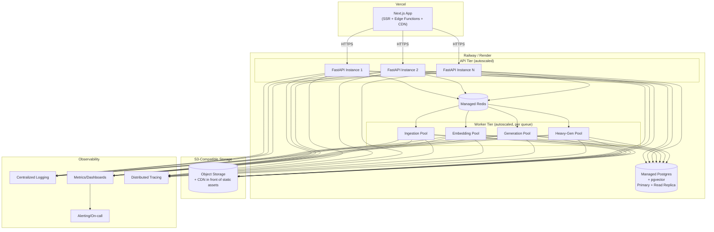
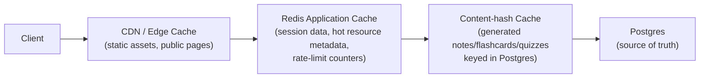

# Lumora — Scalability, Deployment & Future Architecture

---

## 1. Deployment Topology

- **Next.js on Vercel:** static/SSR pages served from the edge, close to users globally; API
  calls proxied to the FastAPI backend. Vercel's edge network handles the CDN layer for the
  frontend without a separate CDN setup.
- **FastAPI on Railway/Render:** chosen over a raw VM/Kubernetes setup for this stage — managed
  container platform gives autoscaling, zero-downtime deploys, and managed Postgres/Redis add-ons
  without the operational overhead of running Kubernetes for a team this size. Revisit trigger in
  §6.
- **Docker** is used regardless of host (Railway/Render both deploy from a Dockerfile), so the
  same image can be lifted to a different platform (including self-managed Kubernetes) later
  without a rewrite — this portability is intentional insurance against platform lock-in.

---

## 2. Horizontal Scaling Strategy

| Layer | Scaling approach |
|---|---|
| FastAPI instances | Stateless — scale horizontally behind the platform's load balancer based on CPU/request-latency thresholds. No sticky sessions required since auth state lives in JWT + Redis, not in-process memory. |
| Celery workers | Scaled **per queue**, based on queue depth (not CPU) — ingestion/embedding/generation/heavy-generation pools scale independently since their load patterns differ (e.g., a viral spike in uploads floods the ingestion queue without necessarily flooding heavy-generation). |
| Postgres | Vertical scaling of the primary first (simplest lever); **read replica** added early for read-heavy paths (resource listing, chat history, roadmap views) so the primary is reserved for writes and vector search. |
| Redis | Managed Redis cluster mode once single-node memory/throughput limits are approached — used for three distinct purposes (Celery broker, cache, rate-limiter) that can be split onto separate Redis instances if they start contending for resources. |
| Object storage | Inherently horizontally scalable (S3-compatible) — no action needed, cost/lifecycle policies matter more than scaling (see §4). |

---

## 3. Caching Strategy (Layered)

- **CDN/Edge:** static frontend assets, marketing pages.
- **Redis:** short-TTL caches for frequently-read, rarely-changed data (user profile, plan tier,
  resource list first page) and all rate-limiting counters.
- **Content-hash cache (Postgres-native):** the most important cache in the system — described in
  `02-database-design.md` §3.4 and `03-ai-rag-pipeline.md` §5. Because it lives in Postgres itself
  (not a separate cache store), there's no cache-invalidation-race risk between "is this note
  current" and "what does this note say" — they're the same row.

---

## 4. Storage & Cost Lifecycle

- Uploaded source files (original PDFs, downloaded video audio for transcription, cloned repo
  archives) are stored in S3-compatible storage with **lifecycle rules**: move to
  infrequent-access tier after 60 days of no access, since the *processed* chunks/embeddings (not
  the raw file) serve almost all ongoing product usage after initial ingestion.
- Raw cloned repository checkouts are **not** persisted long-term — only the extracted chunks are
  kept; the repo is re-cloned transiently if a re-sync is requested, avoiding unbounded storage
  growth from full repo mirrors per user.

---

## 5. Observability

| Concern | Approach |
|---|---|
| Structured logging | JSON logs with request-id/trace-id correlation, shipped to a centralized log store |
| Metrics | RED metrics (Rate/Errors/Duration) per endpoint; queue-depth and worker-throughput metrics per Celery queue; AI cost metrics from `usage_ledger` surfaced on an internal dashboard |
| Distributed tracing | Trace spans across API → Celery task → external LLM call, so a slow "notes generation" can be attributed to extraction vs. embedding vs. LLM latency specifically |
| Alerting | Queue-depth thresholds (ingestion backlog growing = alert), error-rate thresholds per endpoint, LLM provider error-rate (to detect upstream outages before users report them) |
| Cost observability | Daily rollup of `usage_ledger` by operation type — catches runaway generation loops or a prompt regression that suddenly makes one workflow 5x more expensive |

---

## 6. Future Scalability Considerations & Revisit Triggers

This section exists so the team doesn't over-build prematurely, but also doesn't get caught flat-
footed. Each row states the **trigger condition**, not just the future architecture.

| Concern | Current approach | Revisit trigger | Future direction |
|---|---|---|---|
| Service boundaries | Modular monolith + separate worker processes | A subsystem needs independent deploy cadence, different compliance boundary, or a different language runtime | Extract Ingestion and/or Billing as standalone services first — they have the clearest boundaries and independent scaling profiles |
| Vector search | pgvector (HNSW) in primary Postgres | Chunk volume exceeds ~50M rows, or vector query p95 degrades past target despite read-replica offload | Dedicated vector DB (Qdrant/Weaviate) with async dual-write during migration |
| Job queue | Celery + Redis | Queue depth/throughput requirements exceed what Redis-as-broker comfortably handles, or need for durable/replayable event log | Kafka or SQS-based event bus, particularly if event sourcing across subsystems becomes valuable (e.g., analytics needing durable event history) |
| Database | Single Postgres primary + read replica | Write throughput (not just read) becomes the bottleneck, particularly on `usage_ledger`/`chat_messages` | Consider **sharding by user_id/workspace_id** (Citus or manual sharding) — deferred because it adds major complexity and current write volume doesn't warrant it |
| Compute platform | Railway/Render managed containers | Need for fine-grained infra control, custom networking, GPU workloads (e.g., self-hosted embedding models), or cost at scale makes managed platform markup significant | Kubernetes (EKS/GKE) migration — the Docker-first approach (§1) makes this a lift, not a rewrite |
| Multi-region | Single region | Meaningful user base in geographies with poor latency to primary region, or data-residency/compliance requirements (e.g., EU customers) | Read replicas in additional regions first (cheap latency win for reads); full multi-region writes only if truly required, given the complexity/consistency tradeoffs |
| LLM provider dependency | OpenAI/Gemini via an abstraction layer | Provider outage frequency/cost volatility becomes a reliability or margin risk | Multi-provider failover already possible via the `EmbeddingProvider`/generation-provider abstraction (see `03-ai-rag-pipeline.md` §3); extend to automatic failover routing |
| Real-time collaboration | Not in scope for v1 (single-user workspaces) | Product adds shared/collaborative workspaces (teacher + students) | Introduce a presence/collab layer (e.g., WebSocket-based CRDT sync) as an additive subsystem, not a rearchitecture |

---

## 7. Summary of Key Tradeoffs Made

| Decision | Chosen | Rejected alternative | Primary reason |
|---|---|---|---|
| Service topology | Modular monolith + worker processes | Microservices from day one | Team size, deploy simplicity, latency |
| Vector storage | pgvector in Postgres | Dedicated vector DB | Operational simplicity, transactional consistency, sufficient scale headroom |
| Multi-tenancy | Shared schema + row-level scoping + RLS | Schema/DB-per-tenant | Ops overhead unjustified at this tenant count |
| Compute platform | Managed containers (Railway/Render) | Self-managed Kubernetes | Avoids ops burden without team dedicated to infra |
| Chunking | Format-aware, per-source-type chunkers | Universal fixed-size chunker | Retrieval quality is the core product promise |
| Auth token delivery | httpOnly cookie (web) + Bearer (other clients) | Bearer-everywhere via localStorage | XSS resistance for the primary (web) surface |
| Caching for generated content | Content-hash keyed rows in Postgres | Separate cache layer (Redis) for generated content | Avoids invalidation races; source of truth and cache are the same row |
